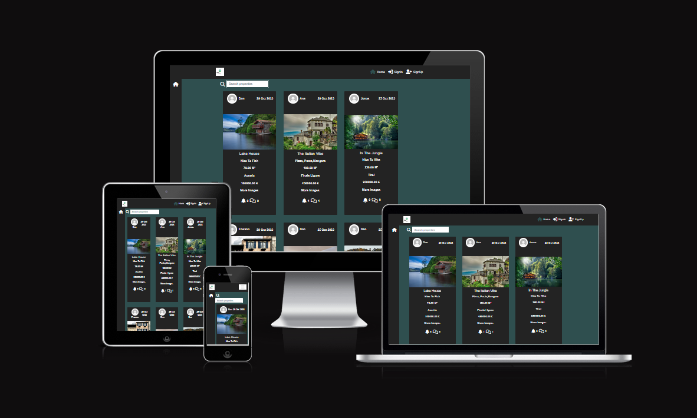
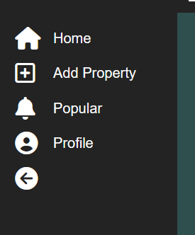
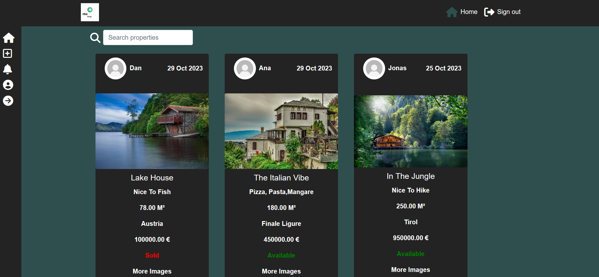
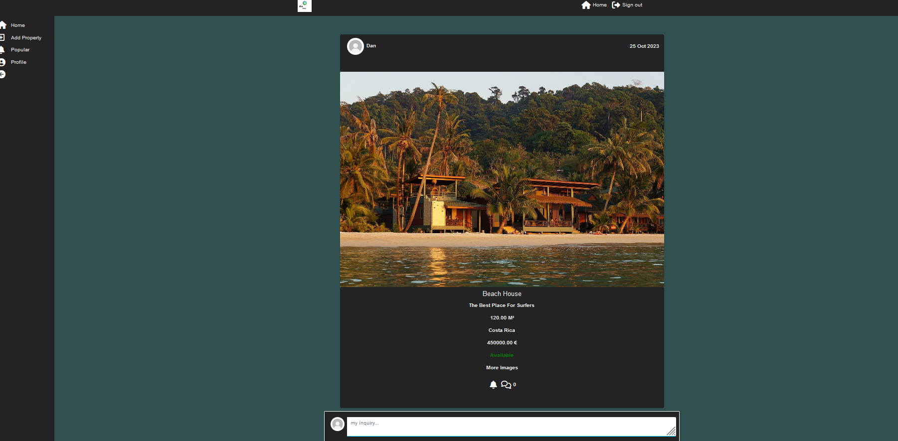
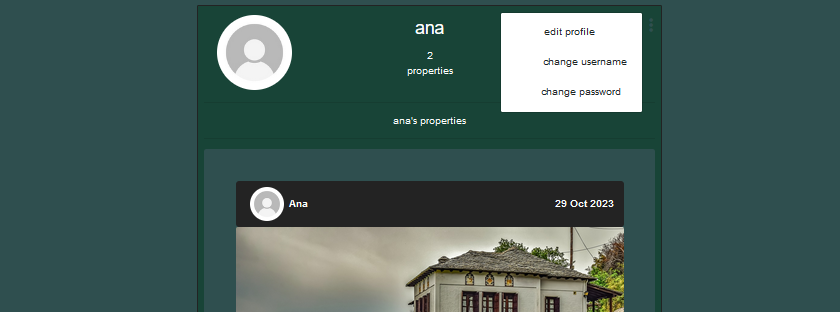
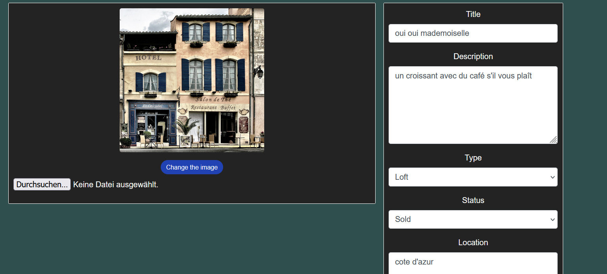
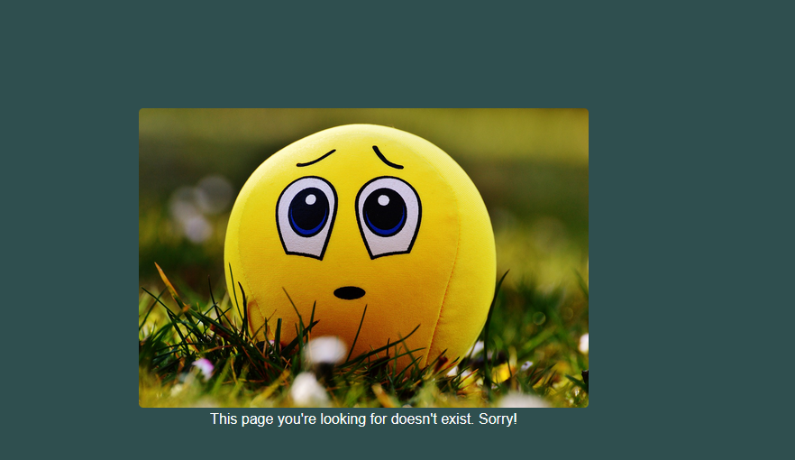
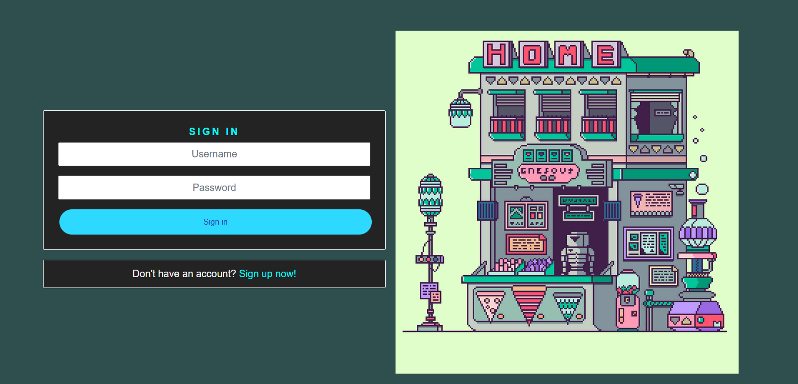
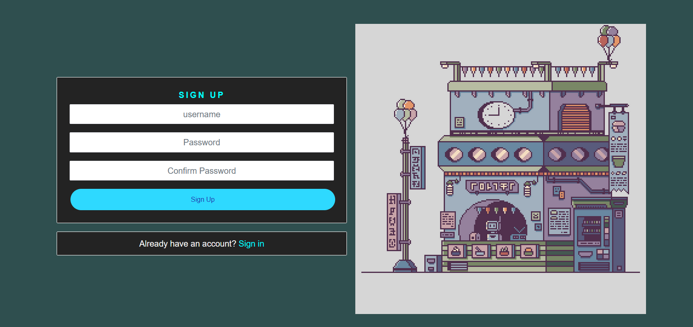
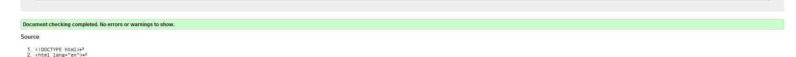

# TheShop

The Shop is a platform where users can upload and sell real estate properties. Once a property is created, the owner can edit and delete it. Other users can view the properties and make inquiries. These inquiries can also be edited and deleted. Additionally, there is an 'Interested' button that users can click. This allows the property owner to see that their property is of interest to others and potentially initiate contact. The entire platform can also be filtered for interesting properties.

The Project can be seen [here](https://the-shop-fe-75bf1203be46.herokuapp.com/)

## User Stories

- **Navigation & Authentication**
  - Navigation: As a user, I can view a navbar and a sidebar from every page so that I can navigate easily between pages.
  - Routing: As a user, I can navigate through pages quickly so that I can view content seamlessly without page refresh.
  - Authentication - Sign up: As a user I can create a new account so that I can access all the features for signed up users
  - Authentication - Sign in: As a user I can sign in to the app so that I can access functionality for logged in users
  - Authentication - Logged in Status: As a user I can tell if I am logged in or not so that I can log in if I need to
  - Authentication - Refreshing access tokens: As a user I can maintain my logged-in status until I choose to log out so that my user experience is not compromised
  - Navigation: Conditional rendering - As a logged out user I can see sign in and sign up options so that I can sign in/sign up
  - Avatar: As a user I can view user's avatars so that I can easily identify users of the application

- **Showing that the user is interesstet in a property**
    - Create properties: As a logged-in user, I can create properties so that I can showcase the property to interested users and provide relevant information.
    - View a property: As a user I can view the details of a property so that I can get interested.
    - Showing interest: As a logged-in user, I can express my interest in a property to indicate that I am interested.

- **The Proprties Page**
    - View most recent properties: As a user I can view all the most recent properties, ordered by most recently created first so that I am up to date with the newest content
    - As a user, I can search for properties with keywords, so that I can find the properties and user profiles I am most interested in.
    - View interesting properties: As a logged in user I can view the properties I am interested in so that I can find these properties better
    - Infinite scroll: As a user I can keep scrolling through the properties on the site, that are loaded for me automatically so that I don't have to click on "next page" etc

- **The Property Page**
    - Property page: As a user I can view the properties page so that I can read the information about the property
    - Edit property: As a property owner I can edit my property title and description so that I can make corrections or update my property after it was created
    - Create a inquiry: As a logged in user I can add inquiries to a property so that I can show my interest
    - Inquiry date: As a user I can see how long ago a inquiry was made so that I know how old a inquiry is
    - View inquiries: As a property owner I can read inquiries on properties so that I can read what other users think about the property
    - Delete inquiries: As the owner of an inquiry, I can delete my inquiry so that I am no longer recognized as interested
    - Edit a comment: As an owner of a comment I can edit my comment so that I can fix or update my existing comment

- **The Profile Page**
    - Profile page: As a user I can view other users profiles so that I can see their posts and learn more about them
    - User profile: As a user I can view statistics about a specific user: bio, number of posts, so that I can learn more about them
    - View all properties by a specific user: As a user I can view all the properties by a specific user so that I can catch up on their newest propertes
    - Edit profile: As a logged in user I can edit my profile so that I can change my profile picture and bio
    - Update username and password: As a logged in user I can update my username and password so that I can change my display name and keep my profile secure

## Features 

- __Header__

    - The header contains the TheShop logo which is a link to the home webpage. The header also contanis the user image or a default avatar. The links to the SignIn SignOut and profilePages are also included here.
    - The header has a fixed position and can be seen on all  webpages at the top of the browser window. 
    - On small screens the header collapes to the logo and a dropdrown burger button.
    - The header tells the user the name of the company and clearly guides the user to all the points that interest them. 
     - Header Images
          

       

  - __The Sidebar__ 

  - The sidebar section includes links to create update delete properties. Also links to filter properties and the property detail view. 
  - The sidebar is colapsible on click and can just be used by loggedin users.

- Sidebar

  
  

### The Homepage

- The homepage is the starting page where you can see all properties in three columns. You can scroll down here and click on individual properties to get detailed information. Additionally, you can also view filtered search results here.
- On smaller screens, you will see only one column instead of three.

    - Landing Page Images

### The Property Page

- On the property page, you can access additional information about the property and view an enlarged image.
- Here, you can express your interest and make purchase inquiries.
- If you are the creator of the property, you can edit or delete it here.

   - Property page
   

### Profile Page

- This page shows all properties the user has created.
- Here other user can show that they are interested in a property of the this user.
- If the user is the owner of this profile, the user can edit the profile here.

  - Profile page
  

### User-Settings Page

- Here the user can change some of his personal data. He can change the username, password and his avatar. 

    - User Settings Image
  

## Create - Update - property

### Update-property Page

- If the user has created a property, they can then update it. By clicking 'edit' on the property, they can change the title and all the other attributes. Additionally, they can change the property status from available to sold and vice versa. 

### 404 Page

- If the user clicks on a link that goes nowhere, they will be directed here.
     - 404 page
    

## Login - Sign Up - Page

- All three pages have been taken over and modified by Ci Moments Project.

### The Login Page

  - This page will allow the user to log in to his or her account. If the user has not yet registered, he can do so here. No user can log in without having registered. There is a link to the signup page.
  - The User can log in with username and password.

  - Login
  

### The Sign Up Pages

  - In the SignUp page, the username and password must be provided. The password must be confirmed afterward. 
  

  - Sign Up
  

## Features Left to Implement

  - Planned features: 
    - In the future, the user will be able to add additional images to their property.
    - TheShop administrator will have a dashboard with statistics on sales, preferred locations, and other data.

## Testing 

- I have manually tested the program in the Code institute Heroku terminal and in my local terminal.by doing the following:
    - I have tested that the website works in different browsers (Chrome and Firefox).
    - I confirm that the website works and looks good on all standard screen sizes. This was tested with the devtools divice toolbar.
    - I confirm that the all forms are working.
    - I confirm that the the user can create, edit and delete properties and inquiries.

    

### Validator Testing

  - HTML
      - No errors were returned when passing through the official W3C validator.
      - All web pages have been tested.

  - CSS
      - No errors were found when passing through the official (Jigsaw) validator.

  - JavaScipt
      - No errors were found when passing through the JSHint validator.
        

  - Accessibility
      - I confirm that the colors and fonts selected are easy to read and accessible. This was discovered using lighthouse in devtools.
      - All web pages have been tested for desktop and mobil devices.

- HTML Validation

- CSS Validation

- JSX Validation
    - with ES-Linter

- Lighthouse

### Unfixed Bugs

 - No Bugs are unfixed.
 - But functions that have to be solved better in the future.
    - In the future, the user will log in with an e-mail address.
    - Other users will see whether you are online or not.nearby and use the link to further information about her/him.

## Deployment

The project was deployed using Code institut's mock for Heroku

    Steps for deployment:
        This repository was cloned.
        A Herroku app was created.
        Added config vars for the secret key, for cloudinary and for the posgresql database.
        The Heroku app was linked to the repository
        Deploy was clicked.

The live link can be found [here](https://the-shop-fe-75bf1203be46.herokuapp.com/)

## Credits 

### Content

- Instructions on how to structure full stack projects, how to work with databasis, how to use Django, Postgresql and Cloudinary, Summernote and Allauth are from [Code Institute - Moments and drf](https://learn.codeinstitute.net/courses/course-v1:CodeInstitute+RA101+2021_T3/courseware/70a8c55db0504bbdb5bcc3bfcf580080/953cd4e5015f483bb05263db3e740e19/)
[and](https://learn.codeinstitute.net/courses/course-v1:CodeInstitute+DRF+2021_T1/courseware/f775d54df4da44d18309888b3fe884f7/bc5fbada70104d489aa0363a03d8bda8/)
- All icons were taken from [Font Awesome](https://fontawesome.com/)
- Font styles were taken from [Google Fonts](https://fonts.googleapis.com)
- The code of the header dropdown menu is taken from Bootstrap. [Bootstrap](https://getbootstrap.com/docs/4.1/components/navbar/)
- The all HTML structures are from Bootrap. [Bootstrap](https://getbootstrap.com/docs/4.1/layout/grid/)
- Instructions on how to buils a sidebar in react are from [Youtube](https://www.youtube.com/watch?v=5R9jFHlG6ik&t=11s)
- The Basic Project idea is from [Youtube](https://www.youtube.com/watch?v=jx5hdo50a2M&t=3301s)

- Color-Scheme
  

### Media

- The Images used on all pages are from this open Source site [Pixabay](https://pixabay.com/de/)
- All Images are stored in the Cloudinary platform.
- The Logo was made with [Canva](https://www.canva.com/create/logos/)

### Personal Advice

  - Thank You!
    -  Jubril Akolade
    - All people from my Slack Group!